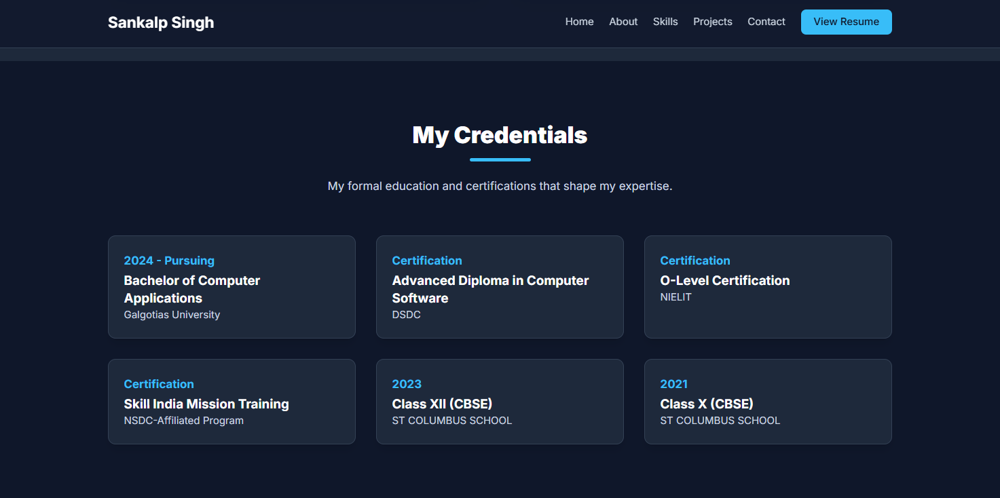

Personal Portfolio

Welcome to my personal portfolio!
This project showcases my work, achievements, and journey as a developer. It highlights my projects, skills, and the progress I’ve made over time.

📖 About

This portfolio is designed to provide a quick overview of who I am, what I do, and how I approach my work. It’s a reflection of my creativity, discipline, and dedication to continuous learning.

-------------------------------------------------------------------------------------------------------------------------------------------------------------------------------------------------------------------------

🚀 Features

Clean and responsive design

Interactive and user-friendly interface

Organized sections for easy navigation

Smooth transitions and modern UI elements

Contact section for collaboration or inquiries

-----------------------------------------------------------------------------------------------------------------------------------------------------------------------------------------------------------------------

📁 Sections Included

Home: A brief introduction about me

About: My background and personal journey

Projects: A showcase of my best work and experiences

Contact: Ways to get in touch or collaborate

-----------------------------------------------------------------------------------------------------------------------------------------------------------------------------------------------------------------------

🧠 Purpose

The main goal of this portfolio is to build a strong digital presence and create a professional space to share my work with others.
